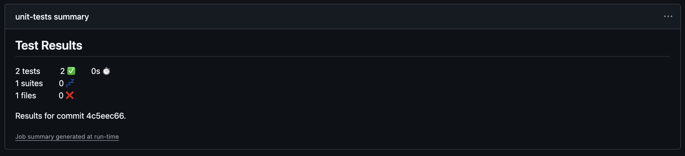
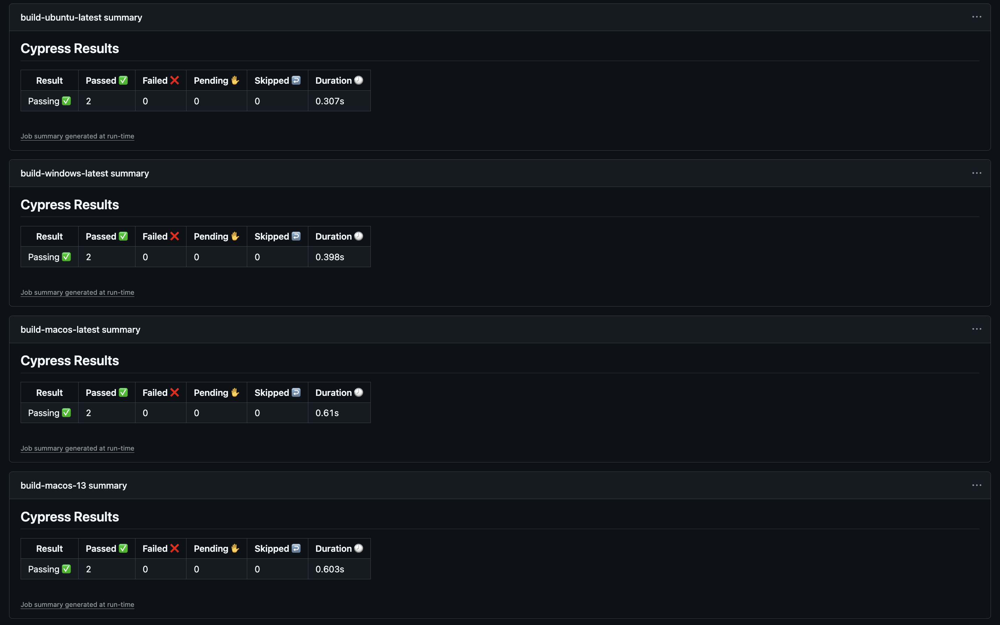
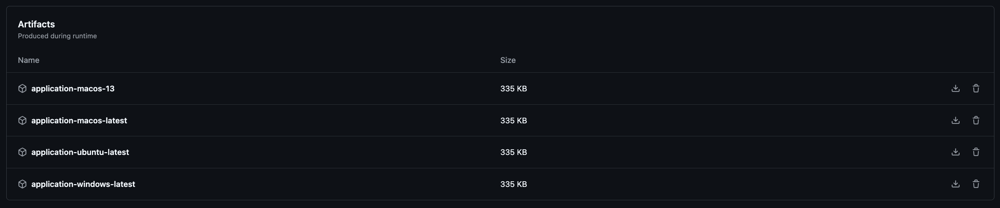

[Ссылка на приложение] (https://mephi-home.website.yandexcloud.net/)

### Про проект

Проект на Typescript + React + Gatsby для сборки статического веб сайта с юнит тестами для компонентов и End-to-end тестами, устанавливается на любой статический хостинг (в данном случае на Yandex Cloud s3).

### Конфигурация

> ci-cd.yml

```yaml
name: ci-cd

on:
  push:

jobs:
  unit-tests:
    runs-on: ubuntu-latest
    permissions:
      checks: write
    steps:
      - uses: actions/checkout@v4
      - uses: actions/setup-node@v4
      - name: Install dependencies
        run: npm ci
      - name: Run unit tests
        run: npm test
      - name: Publish Test Results
        uses: EnricoMi/publish-unit-test-result-action@v2
        if: always()
        with:
          check_run: false
          files: |
            junit.xml
  test-build:
    needs:
      - unit-tests
    name: build-${{matrix.pair.os}}
    runs-on: ${{ matrix.pair.os }}
    strategy:
      matrix:
        pair:
          - os: ubuntu-latest
            browser: chrome
          - os: windows-latest
            browser: edge
          - os: macos-latest # Apple Silicon
            browser: chrome
          - os: macos-13 # Intel
            browser: electron
    steps:
      - uses: actions/checkout@v4
      - uses: actions/setup-node@v4
        with:
          node-version: 22
      - name: Install dependencies
        run: npm ci
      - name: Build web application
        run: npm run build
      - uses: cypress-io/github-action@v6
        with:
          start: npm run serve
          browser: ${{ matrix.pair.browser }}
          config: baseUrl=http://localhost:9000
      - name: Upload Artifact
        uses: actions/upload-artifact@v4
        with:
          name: application-${{ matrix.pair.os }}
          path: ./public
  deploy:
    needs:
      - test-build
    runs-on: ubuntu-latest
    steps:
      - uses: actions/download-artifact@v4
        with:
          name: application-ubuntu-latest
          path: public
      - uses: actions/setup-python@v5
        with:
          python-version: "3.7"
      - name: Install awscli
        run: |
          python -m pip install --upgrade pip
          pip install awscli
      - name: Deploy to yandex cloud s3
        run: aws s3 --endpoint-url=${{ vars.ENDPOINT_URL }} sync public ${{ vars.REPO_URL }} --delete
        env:
          AWS_ACCESS_KEY_ID: ${{ secrets.AWS_ACCESS_KEY_ID }}
          AWS_SECRET_ACCESS_KEY: ${{ secrets.AWS_SECRET_ACCESS_KEY }}
```

### Описание

Пайплайн срабатывает на пуши в репозиторий.

Состоит из следующих джобов:

- unit-tests - джоб для запуска юнит-тестов по компонентам, запускается на ubuntu-latest
  - для загрузки кода из репозитория используется экшн "actions/checkout@v4"
  - для установки nodejs используется экшн "actions/setup-node@v4"
  - для установки зависимостей проекта выполняется скрипт "npm ci"
  - для запуска юнит-тестов выполняется скрипт "npm test"
  - для публикации отчета о выполнении тестов в summary используется экшн "EnricoMi/publish-unit-test-result-action@v2"
- test-build - джоб используется для запуска сборки, e2e тестов и сохранения артифактов из нескольких ОС (ubuntu-latest, macos-13(Intel), macos-latest(Apple), windows-latest), для минимизации дублирования кода джобов используется strategy matrix (пара OS + browser), джоб зависит от джоба unit-tests
  - для загрузки кода из репозитория используется экшн "actions/checkout@v4"
  - для установки nodejs используется экшн "actions/setup-node@v4"
  - для установки зависимостей проекта выполняется скрипт "npm ci"
  - для сборки проекта используется скрипт "npm run build"
  - для запуска e2e тестов используется экшн "cypress-io/github-action@v6", он запускает тесты на уже собранном проекте поднимая локальный сервер на порту 9000
  - для сохранения артифактов используется экшн "actions/upload-artifact@v4" (артифакт публикуется для каждой операционной системы из matrix)
- deploy - джоб для деплоя собранного проекта на Yandex Cloud S3, запускается на ubuntu-latest, зависит от джоба test-build
  - для скачивания ранее собранного кода проекта сохраненного в виде артефакта используется "actions/download-artifact@v4"
  - для установки python используется экшн "actions/setup-python@v5"
  - для установки awscli используются команды "python -m pip install --upgrade pip"
    и "pip install awscli"
  - для деплоя собранного кода из артефакта на s3 используется скрипт "aws s3 sync public ...", переменная информация (такая как адрес эндпоинта и имя репозитория) берется из переменных проекта, а секретная информация (такая как ключи доступа к API S3) берется из секретов проекта

Т.к. обычно юнит-тесты выполняются после компиляции, но до полной сборки проекта, а после сборки проекта выполняются интеграционные и др. тесты, я разместил первым шагом именно юнит-тесты (это еще позволяет экономить ресурсы, которые богли бы быть потрачены на сборку, особенно актуально для платных планов), а e2e тесты объединил со сборкой.

Для данного проекта было бы достаточно собирать только на одной ОС(тоже самое было бы и для проекта на java), но т.к. по условиям нужно было выполнить сборку под несколько ОС, добавил matrix.

### Пример содержния summary рабочего процесса

#### Summary для юнит-тестов



#### Summary для e2e тестов



#### Список артефактов



#### Ссылка на репозиторий

https://github.com/d-dmitriev/MephiGithubActions
